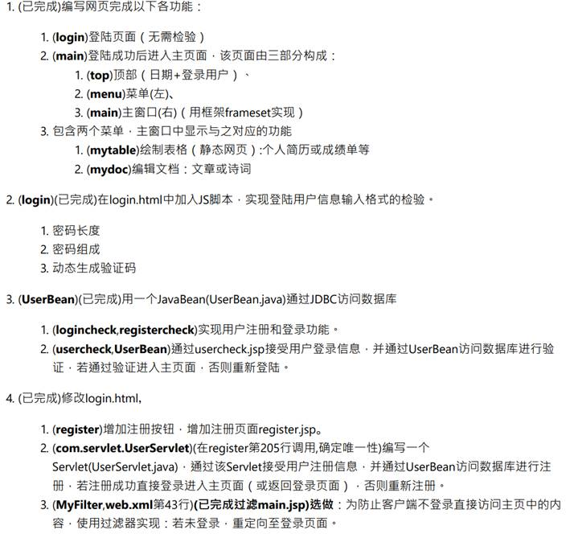
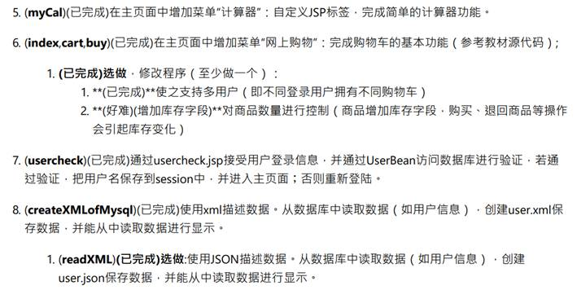
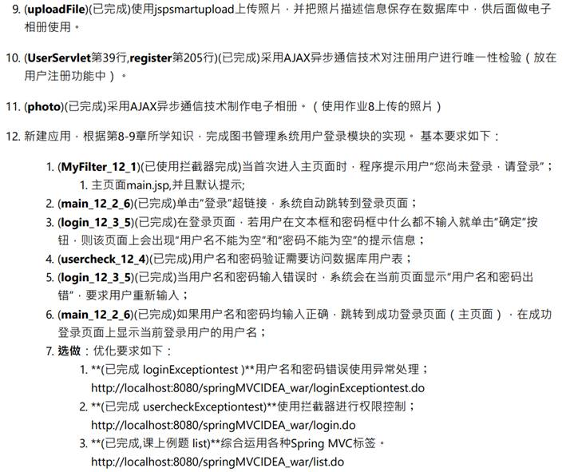

# library-IMIS

a library system generated by java and including modules of login、register、cart、electronic photo album、

1．课程总结：

​	a)    我通过认真学习J2EE，了解并熟悉JavaEE中Web应用的开发、部署、运行，尤其是JavaWEB、JSP与springMVC。

​	b)   可以有条理的从梳理需求开始，研究逻辑，使用servlet、MVC等思想、并结合mysql、HTML、JavaScript、Java多种技术编写包含函数在内的程序，搭建基本网页，并实现如身份验证、购物车、计算器等多种功能。

2．实践程序完成：作业1~11（**包括选做**）集成到一个系统MyJ2EEWeb，作业12（**包括选做**）集成到一个系统springMVCIDEA。程序要求与完成情况如下图。

		
